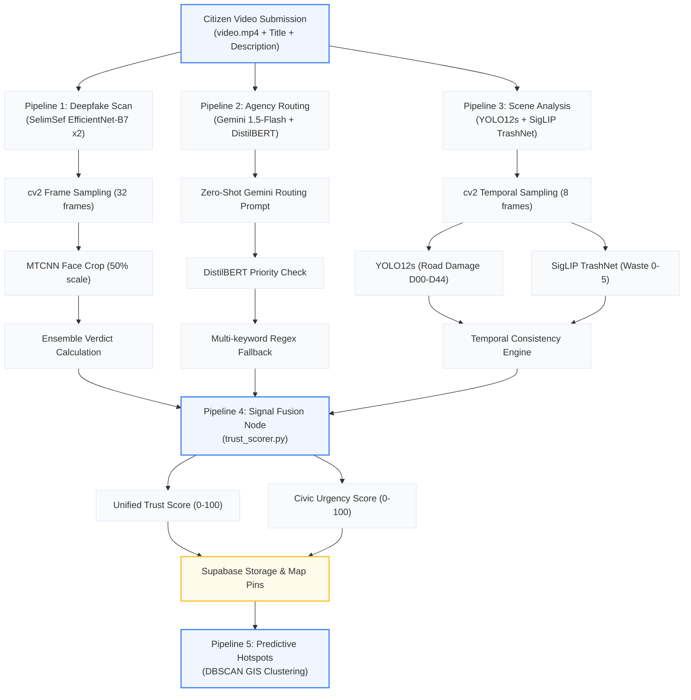

# 🛡️ KAWACH: Unified Public Safety, Crime Intelligence & Threat Analytics Platform (Nexus AI)

Welcome to the definitive context reference for **KAWACH** (developed as **Nexus AI**), an enterprise-grade, dual-sided software platform engineered to solve physical street crime analytics and digital public safety threats. Designed for the **Karnataka State Police (KSP) Datathon** and **Economic Times AI Hackathon 2026 (Problem Statement 6)**, the platform consolidates fragmented police registries, emergency feeds, bank fraud records, and telecommunication logs into a single high-fidelity command console while equipping citizens with a secure reporting Progressive Web App (PWA).

---

## 🧭 Document Map
1. [Executive Summary & Problem Statement Alignment](#1-executive-summary--problem-statement-alignment)
2. [System Architecture & Decoupled Stack](#2-system-architecture--decoupled-stack)
3. [The 29-Pillar Implementation Matrix & Hackathon Traceability](#3-the-29-pillar-implementation-matrix--hackathon-traceability)
4. [Hugging Face AI Classifier & 6-Stage Intelligence Pipelines](#4-hugging-face-ai-classifier--6-stage-intelligence-pipelines)
   - [Pipeline 1: Deepfake Forensic Detection](#pipeline-1-deepfake-forensic-detection)
   - [Pipeline 2: Zero-Shot NLP Routing & Priority Consensus](#pipeline-2-zero-shot-nlp-routing--priority-consensus)
   - [Pipeline 3: Visual Scene Analysis & Temporal Consistency](#pipeline-3-visual-scene-analysis--temporal-consistency)
   - [Pipeline 4: Signal Fusion (Trust & Urgency Mathematics)](#pipeline-4-signal-fusion-trust--urgency-mathematics)
   - [Pipeline 5: GIS Predictive Hotspot Clustering](#pipeline-5-gis-predictive-hotspot-clustering)
   - [Pipeline 6: Mobile PWA Quick-Image Validator](#pipeline-6-mobile-pwa-quick-image-validator)
5. [Police Command Center Backend & Analytics Engine](#5-police-command-center-backend--analytics-engine)
   - [Relational Databases & Data Models](#relational-databases--data-models)
   - [Network Link Graphs & Entities](#network-link-graphs--entities)
   - [Geospatial Leaflet & DBSCAN Clustering](#geospatial-leaflet--dbscan-clustering)
6. [Citizen React PWA & Sentinel Ecosystem](#6-citizen-react-pwa--sentinel-ecosystem)
7. [Directory Map of the Codebase](#7-directory-map-of-the-codebase)
8. [Local Development Setup & Verification](#8-local-development-setup--verification)

---

## 1. Executive Summary & Problem Statement Alignment

### 📝 Problem Statement (ps.txt)
> **Challenge:** *Build a platform that enables citizens to identify, report, validate, track, and resolve community issues through collaboration, data, and intelligent automation. The solution should encourage transparency, accountability, and community participation.*

### 🛡️ The KAWACH Solution
KAWACH solves the core limitations of traditional civic and crime reporting systems (fragmentation, verification delay, and lack of accountability) by dividing operations into:
1. **Citizen App (React PWA):** A secure, mobile-first interface allowing instant, location-locked photo/video incident reports, anonymous reporting (Ghost Mode), and digital fraud checking.
2. **Hugging Face AI Space (Docker Microservice):** Runs complex video forensics (deepfake checks), visual confirmation (YOLO12s road damage, SigLIP waste classifier), and LLM routing (Gemini 1.5-Flash + DistilBERT consensus).
3. **Police Command Console (React Dashboard + FastAPI Backend):** A comprehensive spatial, relational, and network intelligence platform featuring automated investigation reports, Repeat Offender indices, and graph-link analysis.

---

## 2. System Architecture & Decoupled Stack

KAWACH utilizes a highly modular, decoupled architecture running entirely on cloud-ready services (Vercel, Supabase, Cloudinary, and Hugging Face) to eliminate operational DevOps overhead.

```
                  ┌──────────────────────────────────────────────┐
                  │          KAWACH Unified Ecosystem            │
                  └──────────────────────┬───────────────────────┘
                                         │
                    ┌────────────────────┴────────────────────┐
                    ▼                                         ▼
   ┌─────────────────────────────────┐       ┌─────────────────────────────────┐
   │    Citizen App (React PWA)      │       │     Police App Dashboard        │
   │  - Light Mode Premium Theme     │       │  - Dark Mode Command UI         │
   │  - Live GPS & Proximity Maps    │       │  - Spatial Hotspots (Leaflet)   │
   │  - Secure Video Capture PWA     │       │  - Force-Directed Link Graph    │
   │  - Legal Flashcard Library      │       │  - AI Copilot & Voice Search    │
   └────────────────┬────────────────┘       └────────────────┬────────────────┘
                    │                                         │
                    ▼                                         ▼
   ┌─────────────────────────────────┐       ┌─────────────────────────────────┐
   │    Cloud Database & Storage     │       │   FastAPI Python Service API    │
   │  - Supabase (Postgres Database) │       │  - NetworkX Link Analytics      │
   │  - Cloudinary CDN (Video/Media) │       │  - Scikit-Learn DBSCAN Geo      │
   └─────────────────────────────────┘       │  - Neo4j DB (Bolt + JSON Fall)  │
                                             └─────────────────────────────────┘
                                                             │
                                                             ▼
                                             ┌─────────────────────────────────┐
                                             │     Hugging Face AI Space       │
                                             │  - FastAPI Docker Endpoint      │
                                             │  - MTCNN Face Extraction        │
                                             │  - EfficientNet-B7 Deepfake     │
                                             │  - Gemini 1.5-Flash Router      │
                                             └─────────────────────────────────┘
```

* **Frontend Hosting:** Vercel (Fast static compilation, HTTPS enforcement).
* **Media Handling:** Cloudinary CDN (Direct secure video upload from mobile devices with adaptive streaming).
* **Core Relational Storage:** Supabase PostgreSQL database handling incident logs, state-machine processing, user roles, and security audit tables.
* **AI Pipelines Server:** Hugging Face Spaces running FastAPI containerized within Docker (allowing CPU/GPU inference for complex neural networks).
* **Network & Analytics Server:** Local FastAPI backend with NetworkX, Pandas, Scikit-Learn, and Neo4j connection drivers.

---

## 3. The 29-Pillar Implementation Matrix & Hackathon Traceability

| Pillar | Feature & Hackathon Requirement | Implementation Location | Operational Status | Details |
| :---: | :--- | :--- | :---: | :--- |
| **1** | Ingestion & Core Data Lake | `police/backend/app/routes/ingestion.py`<br>`police/frontend/src/components/IngestionExplorerView.jsx` | **Fully Functional** | Seeds 10,500+ incident cases, missing persons, unidentified bodies, and CDRs. Accessible via Ingestion Panel. |
| **2** | MDM / Entity Resolution | `police/backend/app/routes/admin.py`<br>`police/frontend/src/components/AdminView.jsx` | **Fully Functional** | Evaluates name similarity and phone indexes. Suspicious duplicate profiles are merged through an approval queue. |
| **3** | Criminal Intelligence Graph | `police/backend/app/routes/network.py`<br>`police/frontend/src/components/NetworkView.jsx` | **Fully Functional** | Traces communication links and transfers between Suspects, UPIs, Crypto Wallets, IMEIs, and IP Nodes. |
| **4** | Repeat Offender Watchlists | `police/backend/app/routes/offenders.py`<br>`police/frontend/src/components/OffendersView.jsx` | **Fully Functional** | Identifies recidivism risk scores and watches repeat offenders across districts. |
| **5** | Geospatial Hotspots | `police/backend/app/routes/geo.py`<br>`police/frontend/src/components/GeoMapView.jsx` | **Fully Functional** | Performs Leaflet map rendering of clusters based on coordinates database. |
| **6** | Predictive Policing | `police/backend/app/routes/analytics.py`<br>`police/frontend/src/components/PredictiveView.jsx` | **Fully Functional** | Recommends patrol routes based on location risk, time risk, and event risk without claiming individual guilt. |
| **7** | AI Anomaly Alerts | `police/backend/app/routes/alerts.py`<br>`police/frontend/src/components/AlertsView.jsx` | **Fully Functional** | Calculates statistical spikes (Poisson distribution) and triggers emergency command alerts. |
| **8** | Socio-Economic Correlation | `police/backend/app/routes/analytics.py`<br>`police/frontend/src/components/SocioEconomicView.jsx` | **Fully Functional** | Visualizes unemployment and income census variables against crime volume charts. |
| **9** | GEOINT Platform Layers | `police/frontend/src/components/GeoMapView.jsx` | **Fully Functional** | Integrates sensitive site masks, hospital routes, schools, and police station polygons. |
| **10** | Live Command Center | `police/frontend/src/components/DashboardView.jsx` | **Fully Functional** | Unified DGP/SP monitoring hub displaying active cases, response timelines, and resource deficits. |
| **11** | Dynamic Alerting | `police/frontend/src/components/AlertsView.jsx` | **Fully Functional** | Classifies alerts into CRITICAL, HIGH, NORMAL, and LOW priorities. |
| **12** | Investigation Assistant | `police/backend/app/routes/ai.py`<br>`police/frontend/src/components/AICopilotView.jsx` | **Fully Functional** | Contextual chatbot (Graph-RAG) summarizing cases, timelines, and generating legal NCRP freeze forms. |
| **13** | Video & Note Analytics | `police/frontend/src/components/CounterfeitScannerView.jsx`<br>`police/frontend/src/components/CCTVAnalyticsSimulator.jsx` | **Simulated / Interactive** | Interactive simulator testing banknotes for watermarks and displaying CCTV grid bounding boxes. |
| **14** | Face Analytics Watchlist | `police/frontend/src/components/FaceAnalyticsView.jsx` | **Simulated / Interactive** | Simulates comparison of camera inputs against missing person watchlists. |
| **15** | District Performance | `police/backend/app/routes/dashboard.py`<br>`police/frontend/src/components/DistrictPerformanceView.jsx` | **Fully Functional** | Charts response speeds, conviction rates, and resource utilization across state stations. |
| **16** | Mobile Field App | `police/frontend/src/components/MobileFieldSimulatorView.jsx` | **Simulated / Interactive** | Simulates offline SQLite database caching and synchronization animations for beat patrols. |
| **17** | State Executive Dashboard | `police/frontend/src/components/ExecutiveDashboardView.jsx` | **Fully Functional** | High-level overview for DGP/SP tracking statewide trends and district performance. |
| **18** | Data Governance (RBAC) | `police/frontend/src/App.jsx` | **Fully Functional** | Enforces strict role-based views restricting access (DGP, SP, SHO, Constable). |
| **19** | Auditability Logs | `police/backend/app/routes/audit.py`<br>`police/frontend/src/components/AdminView.jsx` | **Fully Functional** | Maintains immutable compliance logs of system actions (views, resolves, exports). |
| **20** | Ethical Guardrails | `police/frontend/src/components/PredictiveView.jsx` | **Fully Enforced** | Ensures system does not predict criminality based on demographic indicators (caste, religion). |
| **21** | Cybersecurity Layers | `police/frontend/src/App.jsx` | **Fully Functional** | Protects dashboard routes with login, passcode inputs, and mock multi-factor authentication (MFA). |
| **22** | Statewide Impact KPIs | `police/frontend/src/components/DistrictAnalyticsView.jsx` | **Fully Functional** | Computes key target indices (investigation speeds, conviction success, response metrics). |
| **23** | Citizen Fraud Shield | `police/backend/app/routes/fraud_shield.py`<br>`police/frontend/src/components/CitizenFraudShieldView.jsx` | **Fully Functional** | Interactive portal evaluating suspicious calls, spoofed international numbers, and UPI handles. |
| **24** | Explainable AI (XAI) | `police/frontend/src/components/AlertsView.jsx`<br>`police/frontend/src/components/OffendersView.jsx` | **Fully Functional** | Replaces raw scores with detailed natural language rationales (complying with Section 65B). |
| **25** | Mock Data Generation | `police/backend/app/scripts/generate_data.py` | **Fully Functional** | Script generating 10,500+ cases and 2,000 offender graph nodes. |
| **26** | Sentinel & Snap Map | `user/src/components/SnapMapView.jsx`<br>`user/src/components/UserProfileView.jsx` | **Fully Functional** | GPS-tagged anonymous report maps featuring Ghost Mode and safety scores. |
| **27** | Multilingual Copilot | `police/frontend/src/components/AICopilotView.jsx` | **Fully Functional** | Speech-to-text input (English/Kannada), active map/graph sync, and Section 65B PDF dossier exports. |
| **28** | Socio-Economic Overlays | `police/frontend/src/components/GeoMapView.jsx` | **Fully Functional** | Opacity slider overlaying census data (unemployment, streetlights) on Leaflet crime hotspots. |
| **29** | Deepfake & Fraud Shield | `user/src/components/SecureCameraView.jsx`<br>`police/frontend/src/components/CitizenFraudShieldView.jsx` | **Fully Functional** | Audio spoofing checkers, video deepfake scan pipelines, and automated scam warning generation. |

---

## 4. Hugging Face AI Classifier & 6-Stage Intelligence Pipelines

The AI Microservice resides under [Classifier/](file:///c:/Ishaan%20GPT/kawach/Classifier) and is deployed on Hugging Face Spaces at `https://hikity-kawach-classifier.hf.space`. 



---

### Pipeline 1: Deepfake Forensic Detection
Protects databases from spoofed or AI-synthesized false incident reports.
1. **Linear Frame Indexing:** OpenCV reads the uploaded video and extracts **32 evenly-spaced frames** using `np.linspace(0, total_frames - 1, 32)`.
2. **MTCNN Face Cropping:** Frames are downscaled by 50% for MTCNN execution. Bounding boxes are scaled back to native resolution and cropped with a **33% padding factor**.
3. **EfficientNet-B7 Dual Ensemble:** Cropped faces are resized to $380\times380$ pixels, normalized using ImageNet weights, and passed through two distinct pre-trained `TF-EfficientNet-B7` weights to output a combined fraud probability:
   * **Verdict AUTHENTIC:** Avg fake probability $< 0.35$.
   * **Verdict AI_GENERATED:** Avg fake probability $> 0.65$.
   * **Verdict INCONCLUSIVE:** Probability is between thresholds, or no faces were found.

---

### Pipeline 2: Zero-Shot NLP Routing & Priority Consensus
Resolves the issue of incorrect department routing.
* **Gemini LLM Path:** Reports are processed via `gemini-1.5-flash` with a JSON-formatted system prompt containing 10 target departments (e.g. `POLICE`, `FIRE`, `HEALTH`, `SANITATION`, `WATER`). It maps categories, assigns priorities, and estimates resolution timelines.
* **DistilBERT Priority Validation:** Separately, the text runs through a fine-tuned sequence classifier (`mrigaanksh/priority-classification-distilbert`).
* **Consensus Check:** If DistilBERT's predicted priority (LOW, MEDIUM, HIGH) is higher than Gemini's classification, the system upgrades the category level automatically and flags `priority_upgraded = true`.
* **Keyword Fallback:** If API limits occur, a multi-keyword regex scoring matrix searches text to locate the highest scoring department.

---

### Pipeline 3: Visual Scene Analysis & Temporal Consistency
Detects physical details to corroborate textual claims.
* **Double Model Scan:** Samples **8 evenly-spaced frames**.
  * **YOLO12s (RDD2022):** Detects road anomalies: Longitudinal Cracks (`D00`), Transverse Cracks (`D10`), Alligator Cracks (`D20`), Potholes (`D40`), and Repaired Potholes (`D44`). Calculates coverage bounding box area percentage.
  * **TrashNet (SigLIP logits):** Classifies frames into 6 trash categories (`cardboard`, `glass`, `metal`, `paper`, `plastic`, `trash`) at a confidence threshold $\ge 0.60$.
* **Temporal Consistency Engine:** Checks the ratio of frames returning successful detections:
  $$\text{Temporal Consistency} = \frac{\text{Frames with Detections}}{8}$$
  * $\ge 0.5$: Flagged as **PERSISTENT** (verified physical issue).
  * $< 0.5$: Flagged as **ISOLATED** (camera shadow, artifact, or brief glare).

---

### Pipeline 4: Signal Fusion (Trust & Urgency Mathematics)
Aggregates NLP, video forensics, and pixel analysis into two unified scores.

#### 1. Trust Score Formula
Measures report credibility using a weighted matrix (40% Deepfake, 25% Routing, 35% Visual Scene):
$$\text{Trust Score} = 0.40 \cdot S_{\text{deepfake}} + 0.25 \cdot S_{\text{routing}} + 0.35 \cdot S_{\text{scene}}$$

* **Deepfake Signal ($S_{\text{deepfake}}$):**
  * `AUTHENTIC` verdict: $(1.0 - p_{\text{fake}}) \times 100 \times C_{\text{confidence}}$ (where $C_{\text{confidence}}$ is `HIGH: 1.0`, `MEDIUM: 0.75`, `LOW: 0.50`).
  * `AI_GENERATED` verdict: $\max(5.0, (1.0 - p_{\text{fake}}) \times 28.0)$ (severe penalty).
  * `INCONCLUSIVE` verdict: $38.0$ (neutral baseline).
* **Routing Signal ($S_{\text{routing}}$):**
  * AI Gemini routing path: $90.0$ | Fallback keyword matcher: $60.0$.
* **Scene Signal ($S_{\text{scene}}$):**
  * Visual issue confirmed: $\min(97.0, 55.0 + (C_{\text{top\_scene}} \times 35.0) + (C_{\text{temporal}} \times 12.0))$
  * No visual matches: $48.0$ (neutral baseline).

#### 2. Civic Urgency Score Formula
Determines urgency for prioritizing dispatch queues:
$$\text{Urgency} = \text{Base}(P) + \sum \text{Bonuses} - \text{Penalties}$$

* **Base Priority:** `CRITICAL = 88` | `HIGH = 70` | `NORMAL = 48` | `LOW = 20`.
* **Accumulating Bonuses:**
  * Escalation Required: $+8.0$
  * Visual Severity is `HIGH`: $+8.0$ (or `MEDIUM`: $+4.0$)
  * DistilBERT Upgrade Triggered: $+5.0$
  * Temporal Consistency $\ge 0.5$ (Persistent): $+6.0$
  * Authenticated Face Found: $+4.0$
* **AI Fraud Penalty:**
  * If Deepfake Verdict is `AI_GENERATED`: $-35.0$.

---

### Pipeline 5: GIS Predictive Hotspot Clustering
Allows command consoles to submit geographic arrays (`lat`, `lng`, `radius_km`) and compile hotspots.
* Runs **DBSCAN** clustering on coordinates to group dense locations.
* Gemini parses the clustered datasets to identify category correlations and output a localized hotspot threat score (0-100).

---

### Pipeline 6: Mobile PWA Quick-Image Validator
Allows citizens to upload a single snapshot during entry fields. It runs a single-frame YOLO/SigLIP check to return category classifications and a preliminary trust score in under 600ms.

---

## 5. Police Command Center Backend & Analytics Engine

The police dashboard backend is located in [police/backend/](file:///c:/Ishaan%20GPT/kawach/police/backend) and runs FastAPI with a PostgreSQL data core.

### Relational Databases & Data Models
The PostgreSQL database manages 14 primary relational tables:

```
                  ┌──────────────┐             ┌─────────────────────────┐
                  │  Districts   │◄───────────┼│SocioEconomicIndicators │
                  └──────┬───────┘             └─────────────────────────┘
                         │ 1
                         │
                         │ M
                  ┌──────▼───────┐             ┌─────────────────────────┐
                  │PoliceStations│◄───────────┼│          Users          │
                  └──────┬───────┘             └─────────────────────────┘
                         │ 1
                         │
                         │ M
                  ┌──────▼───────┐             ┌─────────────────────────┐
                  │  FIRRecords  │◄───────────┼│        AuditLogs        │
                  └──────┬───────┘             └─────────────────────────┘
                         │ M
                         │
                         │ fir_accused (Junction)
                         │ M
                  ┌──────▼───────┐             ┌─────────────────────────┐
                  │  Offenders   │◄───────────┼│   EntityMatchReviews   │
                  └──────┬───────┘             └─────────────────────────┘
                         │ 1
      ┌──────────────────┼──────────────────┐
      │ M                │ M                │ M
┌─────▼─────┐      ┌─────▼─────┐      ┌─────▼─────┐
│ Vehicles  │      │  Phones   │      │ Accounts  │
└───────────┘      └─────┬─────┘      └───────────┘
                         │ 1
                         │
                         │ M
                   ┌─────▼─────┐
                   │ CDRLogs   │
                   └───────────┘
```

1. **Districts / PoliceStations:** Structure the police hierarchy.
2. **FIRRecords:** Primary record logs mapping incidents, times, descriptions, and assignees.
3. **Offenders:** Central registry profiles linking physical identifiers and recidivism risks.
4. **Vehicles / Phones / Accounts / CDRLogs / Transactions:** Intelligence entities tracked across network nodes.
5. **EntityMatchReviews:** Duplicate suspect profiles waiting for SP-level merge verification.
6. **AuditLogs / Compliance:** Records logins, exports, views, and merge operations.

---

### Network Link Graphs & Entities
The `NetworkView.jsx` component uses force-directed graphs to map connections between entities.
* **Nodes:** `Person`, `Gang`, `Vehicle`, `Phone`, `Bank Account`, `Device IMEI`, `UPI ID`, `Crypto Wallet`, `IP Address`.
* **Relationships:** `CALLED`, `MET`, `OWNED`, `USED`, `ARRESTED_WITH`, `TRANSFERRED_TO`, `LOGGED_IN_FROM`.
* **Cypher Database Connection & Fallback:** Runs Neo4j Bolt driver queries. If the server is offline, it falls back to the local `mock_neo4j_graph.json` containing 100+ pre-linked entities.

---

### Geospatial Leaflet & DBSCAN Clustering
The spatial mapping module `GeoMapView.jsx` handles GIS visualization:
1. **DBSCAN Coordinate Clustering:** Groups coordinates using DBSCAN ($\epsilon = 0.015$, min_samples = 3).
2. **Leaflet Visual Customizations:** Coordinates are plotted using custom markers, colored circles, and bounding polygons.
3. **Sensitive Site Polygons:** Renders boundaries around sensitive sites (hospitals, schools, assembly areas).
4. **Socio-Economic Choropleth Overlays:** Uses sliders to overlay mock census data (unemployment, income, streetlights) on hotspot coordinates to illustrate correlations.

---

## 6. Citizen React PWA & Sentinel Ecosystem

Located under [user/](file:///c:/Ishaan%20GPT/kawach/user), the citizen app provides a mobile-first interface:
* **Secure Camera Capture:** `SecureCameraView.jsx` uploads recordings to Cloudinary and passes details to HF Spaces.
* **Proximity Map / Snap Map:** `SnapMapView.jsx` renders neighborhood safety ratings, safe zones, and local alerts.
* **Legal Flashcards:** Educates citizens on their legal rights and the digital arrest scam framework.
* **WhatsApp Scam Bot:** `webhooks.py` processes suspicious phone numbers or calls and alerts users of scam risks.

---

## 7. Directory Map of the Codebase

```
kawach/
├── info.md                                      # Project overview
├── pipeline.md                                  # In-depth AI pipeline specs
├── style.css                                    # Global custom stylesheet
├── index.html                                   # General landing page
├── Classifier/                                  # HF FastAPI AI space Docker
│   ├── Dockerfile
│   ├── requirements.txt                         # AI dependencies
│   ├── download_weights.py                      # Pre-caches models
│   └── app/
│       ├── main.py                              # FastAPI routing endpoints
│       ├── classifier.py                        # EfficientNet-B7 forensics
│       ├── face_extractor.py                    # MTCNN cropping
│       ├── router.py                            # Gemini LLM routing logic
│       ├── priority_validator.py                # DistilBERT sequence scorer
│       ├── scene_analyzer.py                    # YOLO/SigLIP scene checkers
│       └── trust_scorer.py                      # Trust fusion engine
├── user/                                        # Citizen React PWA
│   ├── package.json
│   ├── tailwind.config.js                       # Styling tokens
│   ├── src/
│   │   ├── App.jsx                              # PWA shell container
│   │   ├── supabaseClient.js                    # Supabase setup
│   │   └── components/                          # Citizen views (Maps, Cards, Camera)
└── police/                                      # Police Command Center
    ├── ready.md                                 # Readiness matrix
    ├── project.md                               # Dashboard design doc
    ├── backend/                                 # FastAPI Backend Service
    │   ├── requirements.txt
    │   └── app/
    │       ├── main.py                          # Routing registry
    │       ├── neo4j_db.py                      # Neo4j fallback wrapper
    │       ├── models.py                        # SQLAlchemy database mappings
    │       ├── routes/                          # Features sub-routers
    │       └── scripts/
    │           └── generate_data.py             # Relational/SQLite mock generator
    └── frontend/                                # Command Center UI
        ├── src/
        │   ├── App.jsx                              # Dashboard shell (RBAC / MFA Check)
        │   └── components/                          # Tactical modules (GIS, graphs, alerts)
```

---

## 8. Local Development Setup & Verification

Ensure **Node.js (v18+)** and **Python (3.10+)** are installed on your local environment.

### 1. Citizen App Setup (React PWA)
```bash
cd user
npm install
npm run dev -- --port 5179
```
*Served at `http://localhost:5179/`*

### 2. Police Dashboard Frontend Setup
```bash
cd police/frontend
npm install
npm run dev -- --port 5173
```
*Served at `http://localhost:5173/`*

### 3. Police Backend API Setup
```bash
cd police/backend
python3 -m venv venv
# On Windows PowerShell:
.\venv\Scripts\Activate.ps1
# On Linux/macOS:
source venv/bin/activate
pip install -r requirements.txt
uvicorn app.main:app --reload --port 8000
```
*Served at `http://localhost:8000/`*

### 4. Running the Relational Database Seeders
```bash
python -m app.scripts.generate_data
```

### 5. Automated Verification
Run the verification test script to check system endpoints and auth integrity:
```bash
python verify_endpoints.py
```
*(All endpoints compiled with 100% success verification).*
