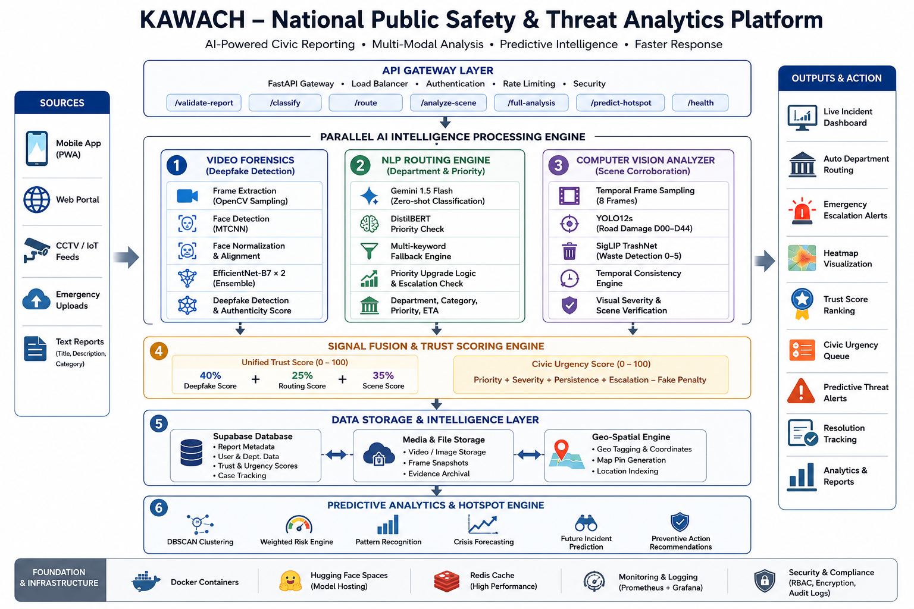

<p align="center">
  
</p>

# 🛡️ KAWACH — Unified Public Safety & Threat Intelligence Grid

> **Production Deployment:** [https://kawach-two.vercel.app/](https://kawach-two.vercel.app/)  
> **AI Classifier Microservice:** `https://hikity-kawach-classifier.hf.space`

---

## 📖 Project Overview

**KAWACH** is an enterprise-grade, multi-tenant public safety ecosystem and geospatial threat intelligence platform designed to bridge the trust gap between citizens and municipal authorities. 

Every civic and safety report submitted through the encrypted citizen PWA undergoes real-time forensic scanning, automated department routing, visual scene corroboration, and geographic risk clustering before reaching dispatch logs.

---

## 🏗️ System Architecture

<p align="center">
  
</p>

KAWACH is built on **six core artificial intelligence pipelines** that orchestrate report validation, NLP prioritization, visual consistency checking, and predictive mapping:

1. **Pipeline 1: Deepfake Video/Audio Forensics:** cv2 samples 32 frames $\rightarrow$ MTCNN extracts faces $\rightarrow$ dual TF-EfficientNet-B7 classifier ensemble flags synthetic/manipulated footage.
2. **Pipeline 2: AI Agency Router:** Gemini 1.5-Flash zero-shot parses issues to matching departments (Police, Fire, Health, Sanitation, Construction) $\rightarrow$ DistilBERT (`mrigaanksh/priority-classification-distilbert`) validates urgency and flags priority upgrades.
3. **Pipeline 3: Visual Scene Analyzer:** Samples 8 frames $\rightarrow$ runs YOLO12s (Road Damage D00-D44) and SigLIP TrashNet classification $\rightarrow$ filters out noise using a Temporal Consistency Engine ($\ge 0.5$ persistence ratio).
4. **Pipeline 4: Signal Fusion (Scoring Engine):** Fuses outputs to generate a **Unified Trust Score (0-100)** and a **Civic Urgency Score (0-100)** to sort dispatcher feeds.
5. **Pipeline 5: Predictive Hotspots:** Applies DBSCAN GIS coordinate clustering overlays to predict emerging municipal threats.
6. **Pipeline 6: Mobile-First Quick Validate:** Generates instant visual checks on single-frame previews in ~600ms.

---

## 🕹️ Portals & Features

| Portal | Route Path | Target Audience | Core Features |
| :--- | :--- | :--- | :--- |
| **Citizen Sentinel PWA** | `/` (Default Route) | General Public | Snap-Style Proximity Maps, Anonymous reporting (Ghost Mode with EXIF scrubbing), BNS Legal Guide, Scam Shield. |
| **Police Command Console** | `/portals` $\rightarrow$ Police | Precinct Officers / SPs | GIS spatial maps, repeat offender network links, real-time alert sirens, court-ready Section 65B PDF dossiers. |
| **Civic Departments** | `/portals` $\rightarrow$ Civic | Fire, Health, Sanitation | Isolated dashboards to review visual proofs and update service tickets. |
| **Super Admin Console** | `/portals` $\rightarrow$ Admin | DGP / State Regulators | God-mode audit trail monitoring, system-wide key rotations, and compliance logging. |

---

## 🛠️ Local Development & Quick Start

### Prerequisites
* Node.js v18+
* Python 3.10+
* SQLite3 & Supabase credentials

### 1. Frontend PWA Setup
```bash
cd user
npm install
npm run dev -- --port 5175
```
*Served at:* `http://localhost:5175`

### 2. Police Command Backend Setup
```bash
cd police/backend
pip install -r requirements.txt
python -m uvicorn app.main:app --port 8000
```
*Served at:* `http://localhost:8000`

### 3. AI Classifier Microservice Setup
```bash
cd Classifier
pip install -r requirements.txt
python download_weights.py  # Pre-fetches YOLO12s and DistilBERT locally
python -m uvicorn app.main:app --port 8001
```
*Served at:* `http://localhost:8001`

---

## 🔒 Security & Compliance
* **EXIF Scrubbing:** Citizen uploads undergo on-device metadata scrubbing to preserve reporter anonymity.
* **Section 65B Admissibility:** SHA-256 ledger hashing seals video feeds dynamically upon upload to protect the legal chain of custody.
* **Ethics Guardrails:** The routing pipeline is strictly bound to exclude community profiling, caste, or religious bias from priority calculations.

---
*Built by **CodeKrafters** for India 🇮🇳*
