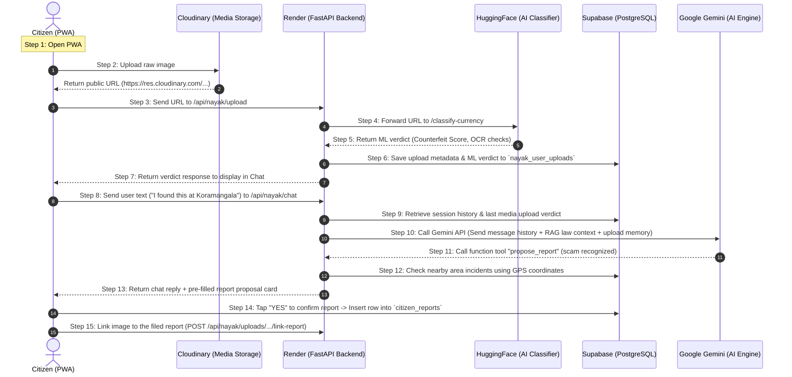

# 🛡️ KAWACH Project Handover Document

This document serves as a comprehensive technical handover for **KAWACH** — a Unified Public Safety & Threat Intelligence Grid. It details the architecture, tech stack, AI models, and deployment instructions necessary for any developer or team to take over, maintain, and scale the project.

---

# 🔄 How KAWACH Works (A Citizen's Walkthrough Flow)

## 🟢 Simple Language: How it Works (For Frontend Integration)

Here is exactly how the app processes a user action, for example: **A citizen uploads a picture of a fake ₹500 note in the chat and asks if they can trust it.**



### The Step-by-Step Walkthrough

1. **Citizen opens the app:** The browser loads the pre-built React app from **Vercel** (`kawach-two.vercel.app`). Vercel's job is done here; all subsequent operations are direct API calls from the user's browser.
2. **Citizen uploads a photo:** When the user taps the paperclip icon in the Nayak chat and picks an image, the browser uploads the raw bytes **directly to Cloudinary**. Cloudinary returns a public image URL.
3. **URL sent to Backend:** The browser sends that public URL to our Python backend on **Render** (`https://kawach-police.onrender.com/api/nayak/upload`).
4. **Backend calls AI Classifier:** Render fetches the image and passes it to the **Hugging Face** Space microservice.
5. **AI Model Runs:** The Hugging Face server runs the custom trained **EfficientNet** neural network and classical CV checks (security thread continuity, serial number ascending checks). It returns a raw JSON verdict and immediately discards the image (no storage).
6. **Verdict Saved:** Render writes the verdict into **Supabase** under the `nayak_user_uploads` table, linking this session, the image URL, and the classification result.
7. **Verdict Displayed:** Render replies to the browser, and the chat UI displays a message card (e.g., "❌ FLAGGED SUSPICIOUS").
8. **Citizen asks a question:** The citizen types a reply ("I found this at Koramangala market"). The browser sends this to Render via `POST /api/nayak/chat`.
9. **Memory Retrieval:** Render loads the user's chat history plus the last media upload verdict from Supabase.
10. **Gemini Decides:** Render sends this compiled context (history + upload memory) to the **Google Gemini API**. Gemini notices that this is a scam attempt and calls our local `propose_report` function tool.
11. **Report Proposal Enriched:** Render intercepts the tool call, searches Supabase for other incidents nearby (`get_area_incidents`), assigns a civic department, and sends a draft report back to the user's chat.
12. **Citizen Confirms:** The citizen sees a yellow card saying "File Report?". Tapping "YES" makes the browser write a new record directly into the `citizen_reports` table in **Supabase**.
13. **Upload Linked:** The browser tells Render to link the original photo to the new report (`/api/nayak/uploads/{uploadId}/link-report`).
14. **Dashboard Update:** The new report immediately populates the municipal or police dashboard reading from Supabase.


---

## 🌐 Hosting & Services Inventory

Here is the exact distribution of components across the platforms used, how they interact, and their links:

| Platform / Service | Component Hosted | Role in Flow of Usage | Exact Links & Details |
| :--- | :--- | :--- | :--- |
| **Vercel** | • Citizen PWA Frontend (`user/`) <br>• Police Console Frontend (`police/frontend/`) | • Serves the static HTML/CSS/JS assets to the user's browser.<br>• Communicates directly with Supabase, Cloudinary, and the Render backend via API requests. | • Citizen App: [kawach-two.vercel.app](https://kawach-two.vercel.app/) <br>• Repos connected to Vercel auto-deploys. |
| **Render** | • Police Command Backend (`police/backend/`) | • Python / FastAPI app handling backend orchestration.<br>• Connects to Supabase Database.<br>• Runs the Nayak conversational agent loop and handles PDF dossier generation. | • Base URL: [kawach-police.onrender.com](https://kawach-police.onrender.com) <br>• Swagger API Docs: [kawach-police.onrender.com/docs](https://kawach-police.onrender.com/docs) <br>• Admin Debug: [/api/nayak/_debug_env](https://kawach-police.onrender.com/api/nayak/_debug_env) |
| **Hugging Face** | • AI Classifier Microservice (`Classifier/`) | • Multi-modal forensic scanning microservice.<br>• Runs PyTorch CNNs for currency checks and video/audio deepfake diagnostics.<br>• Accepts media URLs, processes them, and returns JSON verdicts. | • Space API: [hikity-kawach-classifier.hf.space](https://hikity-kawach-classifier.hf.space) <br>• Currency Endpoint: `POST /classify-currency` <br>• Video/Audio Endpoint: `POST /classify` |
| **Supabase** | • PostgreSQL Database <br>• RAG Rulebook Tables <br>• Realtime updates listener | • Central database holding reports (`citizen_reports`), chat logs (`nayak_messages`), and the 3,974 legal rulebook chunks (`nayak_law_chunks`).<br>• Frontend reads/writes reports directly from the Supabase Client SDK. | • API Host: `https://jlqelkrfeksixxfkulwf.supabase.co` <br>• Table schema is fully automated (additive migrations on backend boot). |
| **Cloudinary** | • Secure Media Storage CDN | • Accepts raw media uploads directly from the user's browser via unsigned presets.<br>• Returns permanent URLs which are then passed to the backend for AI analysis. | • Cloud Name: `kijqhnss` <br>• Upload Preset: `kawach_preset` <br>• Direct URL structure: `https://res.cloudinary.com/kijqhnss/...` |
| **Google Gemini API** | • Generative AI & Tool calling | • Generates citation-backed advice based on search inputs.<br>• Uses function calling to invoke local backend tool routines (e.g. `propose_report` / `search_law`). | • Model: `gemini-1.5-flash` <br>• API Endpoint: `generativelanguage.googleapis.com` |

---


## 🛠️ Technical Details & System Flow Specifications

### 📡 1. Media Upload & Forensic Scan Pipeline (`POST /api/nayak/upload`)
* **Endpoint:** `POST https://kawach-police.onrender.com/api/nayak/upload`
* **Request Schema:**
  ```json
  {
    "media_url": "https://res.cloudinary.com/.../img.jpg",
    "media_type": "image", // 'image' or 'video'
    "session_id": "3c9f778a-d9dd-47fe-884d-2bf8aae3c839"
  }
  ```
* **Processing:**
  1. If `media_type` is `"image"`, the backend forwards the binary stream to `https://hikity-kawach-classifier.hf.space/classify-currency`.
  2. If `media_type` is `"video"`, it forwards to `https://hikity-kawach-classifier.hf.space/classify`.
  3. The response is saved in the `nayak_user_uploads` table:
     ```json
     {
       "id": "upload-uuid",
       "session_id": "session-uuid",
       "media_url": "url",
       "media_type": "image",
       "classifier_verdict": {
         "is_authenticated": false,
         "score": 12.5,
         "verdict": "SUSPECT_FEATURES",
         "details": "Currency screening: SUSPECT_FEATURES. Security thread broken; microprint blurry"
       }
     }
     ```

### 💬 2. Nayak Conversational Agent Pipeline (`POST /api/nayak/chat`)
* **Endpoint:** `POST https://kawach-police.onrender.com/api/nayak/chat`
* **Request Schema:**
  ```json
  {
    "session_id": "session-uuid-or-null",
    "message": "User text input",
    "lat": 12.9716,
    "lng": 77.5946
  }
  ```
* **Agent Memory Assembly:**
  1. Retrieve message history from table `nayak_messages` sorted by `created_at` ascending.
  2. Query `nayak_user_uploads` for the most recent upload in this session. Assemble an `uploads_context` string.
  3. Inject `uploads_context` and GPS location into Gemini system instructions.
  4. Call `gemini-1.5-flash` with the history payload, system prompt, and the `tools_manifest` (search_law, check_link, classify_text, get_area_incidents, propose_report).
  5. If Gemini invokes `propose_report`, local backend code calls `enrich_proposal` to look up nearby incidents (`get_area_incidents`), auto-selects the department (e.g. `POLICE`, `FIRE`), sets priority severity, and embeds the reference `upload_id`.
  6. Gemini processes the tool outputs and generates its final conversational response.

### 📝 3. Direct Report Submission (`supabase-js`)
* **File:** `user/src/api/reportService.js`
* **Action:** The frontend inserts directly into Supabase `citizen_reports` using the Anon Key.
* **Fields:** `category`, `description`, `latitude`, `longitude`, `media_url`, `media_type`, `priority`, `routed_department`, `status: 'OPEN'`, `source: 'nayak_chat'`.
* **Link Call:** Once the row is inserted, the frontend triggers `POST /api/nayak/uploads/{uploadId}/link-report` to complete the chain of custody link in the database.

---


## 📌 Executive Summary
>>>>>>> 1973594f728f37aba2a9b52a07157e3c09c61ac4

**KAWACH** is a multi-tenant public safety ecosystem designed to bridge the trust gap between citizens and municipal/law enforcement authorities. It allows citizens to report incidents via an encrypted PWA, which are then analyzed in real-time by multiple AI pipelines for validation, urgency, and routing before reaching the respective department dashboards.

### Core Portals
1. **Citizen Sentinel PWA:** A React-based mobile-first web app for anonymous reporting (Ghost Mode), scam verification, and interacting with the Nayak AI Legal Assistant.
2. **Police Command Console:** A dashboard for law enforcement featuring GIS spatial maps, repeat offender network graphs, and court-ready Section 65B PDF generation.
3. **Civic Departments Console:** Isolated dashboards (Fire, Health, PWD, Sanitation) to review AI-routed reports and manage service tickets.
4. **Super Admin Console:** System-wide monitoring and audit trails.

---

## 2. System Architecture

The system follows a microservices-inspired architecture, separating the citizen-facing frontend, the central police/routing backend, and the specialized AI classifier service.

### 2.1 Tech Stack Summary
*   **Frontend (Citizen PWA):** React.js (Vite), Tailwind CSS.
*   **Frontend (Dashboards):** Vanilla HTML/JS/CSS (for lightweight department portals) and React for Police.
*   **Backend (Core Services):** Python, FastAPI.
*   **Backend (AI Classifier):** Python, FastAPI, PyTorch, TensorFlow, OpenCV.
*   **Databases:**
    *   **Relational:** SQLite (Development) / PostgreSQL (Production)
    *   **Vector:** pgvector (for RAG embeddings)
    *   **Graph:** Neo4j (for offender/incident relationship networks)
    *   **Auth/Storage:** Supabase

---

## 3. AI Models & Forensic Pipelines

KAWACH relies on six core AI pipelines to process and validate incoming reports:

### Pipeline 1: Deepfake Video/Audio Forensics
*   **Function:** Detects synthetic or manipulated media.
*   **Workflow:** OpenCV extracts frames $\rightarrow$ MTCNN extracts faces $\rightarrow$ Dual **TF-EfficientNet-B7** classifier ensemble flags anomalies.

### Pipeline 2: AI Agency Router & Priority NLP
*   **Function:** Parses textual reports, routes them to the correct department, and assigns urgency.
*   **Models:** 
    *   **Gemini 1.5-Flash (Zero-shot):** Department classification (Police, Fire, Health, Sanitation, etc.).
    *   **DistilBERT (`mrigaanksh/priority-classification-distilbert`):** Validates urgency and flags high-priority incidents.

### Pipeline 3: Visual Scene Analyzer (Object Detection)
*   **Function:** Corroborates user text with image/video content.
*   **Models:**
    *   **YOLO12s:** Detects specific issues like Road Damage (D00-D44).
    *   **SigLIP:** Zero-shot classification for generalized scenes (e.g., TrashNet categories).
    *   **Temporal Consistency Engine:** Filters out noise in videos (requires $\ge 0.5$ persistence ratio across frames).

### Pipeline 4: Signal Fusion (Scoring Engine)
*   **Function:** Aggregates AI outputs into actionable metrics.
*   **Outputs:** 
    *   **Unified Trust Score (0-100):** Confidence that the report is genuine (not a deepfake or spam).
    *   **Civic Urgency Score (0-100):** Severity of the incident.

### Pipeline 5: Predictive Hotspots (GIS)
*   **Function:** Identifies emerging threat zones.
*   **Algorithm:** **DBSCAN** spatial clustering over geographic coordinates of recent high-urgency reports.

### Pipeline 6: Currency Authentication (Counterfeit Detection)
*   **Function:** Analyzes images of banknotes to detect fakes.
*   **Model:** Custom **PyTorch CNN** trained on Indian currency datasets.

---

## 4. Nayak AI Legal Assistant (RAG System)

Nayak is an intelligent chatbot designed to help citizens understand their legal rights and verify scams.
*   **Knowledge Base:** Over 3,900+ vectorized sections of Indian Law, including the Bharatiya Nyaya Sanhita (BNS), BNSS, BSA, IT Act, and RBI Circulars.
*   **Technology:** 
    *   Primary: Retrieval-Augmented Generation (RAG) using the **Gemini API**.
    *   Fallback: If the API key is missing or offline, Nayak gracefully degrades to a keyword-based retrieval system providing structured, bulleted advice and legal citations.
*   **Features:** Scam Verification (Digital Arrests, Extortion), Traffic Rights, UPI Fraud guidance.

KAWACH operates **seven distinct AI/ML and computer vision pipelines**:

### 1. Pipeline 1: Deepfake Video & Audio Forensics (`app/classifier.py`)
* **Architecture:** Frame extraction via `cv2` (32 frames) $\rightarrow$ Face detection via MTCNN $\rightarrow$ Dual **TF-EfficientNet-B7** classifier ensemble.
* **Function:** Detects synthetic media, facial swapping, and voice cloning in uploaded files.
* **Output:** `is_deepfake: bool`, `confidence: float`, `face_count: int`.

### 2. Pipeline 2: Zero-Shot Agency Router & Urgency Classifier (`app/router.py`)
* **Architecture:** **Gemini 2.5 Flash** (zero-shot department mapping) $\rightarrow$ **DistilBERT** (`mrigaanksh/priority-classification-distilbert`) urgency validation.
* **Function:** Maps free-text incident descriptions to matching departments and calculates priority upgrades (LOW, MEDIUM, HIGH, CRITICAL).
* **Fallback:** Local keyword heuristic fallback if API key or network is unreachable.

### 3. Pipeline 3: Visual Scene Analyzer (`app/scene_analyzer.py`)
* **Architecture:** Samples 8 frames $\rightarrow$ **YOLO12s** (Road Damage D00-D44) + **SigLIP TrashNet** classification.
* **Temporal Consistency Engine:** Filters out false positives by enforcing a persistence ratio ($\ge 0.5$) across sampled frames.

### 4. Pipeline 4: Signal Fusion Scoring Engine (`app/trust_scorer.py`)
* **Deterministic Scoring:** Fuses deepfake confidence, visual scene consistency, and NLP priority into two 0–100 metrics:
  * **Unified Trust Score (0–100):** Authenticity rating of the media report.
  * **Civic Urgency Score (0–100):** Dispatch sorting priority.

### 5. Pipeline 5: GIS DBSCAN Hotspot Clustering (`police/backend/app/routes/geo.py`)
* **Algorithm:** DBSCAN with Haversine spatial distance metric (`eps_km=1.0`, `min_samples=3`).
* **Function:** Identifies emerging crime clusters and calculates centroid coordinates for patrol dispatch.

### 6. Pipeline 6: Counterfeit Currency Screening (`Classifier/app/currency_detector.py`)
* **Architecture:** Trained **EfficientNet-B0** CNN (Kaggle T4 trained) + 4 Classical Computer Vision checks:
  1. Security thread continuity & alignment check.
  2. Microprint Laplacian sharpness score.
  3. Print-noise profile analysis.
  4. **Telescopic Serial Number Check:** EasyOCR + column ink-height profiling to verify ascending numeral sizing (RBI anti-counterfeit standard).
* **Performance:** **91.9% test accuracy** (AUC 0.964; circulating denominations ₹10–₹500 average 93.0%).
* **UV Mode:** Gated check for `capture_mode="uv"`.

### 7. Pipeline 7: Digital Arrest Live-Session Monitor (`police/backend/app/routes/digital_arrest.py`)
* **Architecture:** Real-time multi-modal session scoring (`POST /api/digital-arrest/session/{id}/signal`).
* **Weights:** Text scam-script scoring (.30) + Voice spoof prob (.20) + Video deepfake prob (.20) + Transaction anomaly (.30).
* **Automated Alerting:** Dispatches `ALERT_DISPATCHED` warning at $\ge 70\%$ threshold *before* monetary transfer completes.
>>>>>>> 1973594f728f37aba2a9b52a07157e3c09c61ac4

---

## 5. Security & Compliance Features

*   **EXIF Scrubbing:** The Citizen PWA automatically strips metadata from images before upload to maintain anonymity (Ghost Mode).
*   **Section 65B Admissibility:** All media uploads generate a SHA-256 hash. The system creates PDF dossiers compliant with the Indian Evidence Act / BSA to preserve the chain of custody.
*   **Zero-Bias Guardrails:** The NLP routing pipeline is explicitly prompted and constrained to avoid demographic, caste, or religious profiling.

---

## 6. Directory Structure

```text
/
├── Classifier/             # AI Microservice (YOLO, EfficientNet, PyTorch)
│   ├── app/                # FastAPI app for model inference
│   ├── weights/            # Pre-trained model weights (.pt, .h5)
│   └── requirements.txt
├── departments/            # Civic Department HTML/JS Dashboards
├── plan/                   # Project planning docs and progress trackers
├── police/
│   └── backend/            # Main Core Backend (FastAPI, Neo4j, DB Models)
│       ├── app/
│       │   ├── routes/     # API Endpoints (Nayak, Digital Arrest, etc.)
│       │   └── scripts/    # Data ingestion and DB setup scripts
├── user/                   # Citizen Sentinel PWA (React + Vite)
│   ├── src/
│   │   ├── components/     # UI Components (ChatView, AdminView, etc.)
│   │   └── api/            # API service calls
├── info.md                 # Brief project info
└── README.md               # Quickstart guide
```

---

## 7. Environment Variables & Configuration

You will need the following environment variables configured across the services:

### Police Backend (`police/backend/.env`)
```env
DATABASE_URL=sqlite:///./test.db # Or PostgreSQL connection string
NEO4J_URI=bolt://localhost:7687
NEO4J_USER=neo4j
NEO4J_PASSWORD=password
GEMINI_API_KEY=your_gemini_api_key # For Nayak RAG
SUPABASE_URL=your_supabase_url
SUPABASE_KEY=your_supabase_anon_key
```

### Citizen PWA (`user/.env`)
```env
VITE_API_BASE_URL=http://localhost:8000
VITE_SUPABASE_URL=your_supabase_url
VITE_SUPABASE_ANON_KEY=your_supabase_anon_key
```

---

## 8. Development & Deployment Guide

### Local Setup
1.  **Citizen PWA:**
    ```bash
    cd user
    npm install
    npm run dev -- --port 5175
    ```
2.  **Core Backend:**
    ```bash
    cd police/backend
    python -m venv venv
    source venv/bin/activate
    pip install -r requirements.txt
    uvicorn app.main:app --port 8000 --reload
    ```
3.  **AI Classifier:**
    ```bash
    cd Classifier
    python -m venv venv
    source venv/bin/activate
    pip install -r requirements.txt
    python download_weights.py
    uvicorn app.main:app --port 8001 --reload
    ```

### Known Issues & Maintenance Notes
*   **Neo4j Fallback:** If the Neo4j graph database is unavailable, the backend gracefully falls back to an in-memory mock graph to prevent API crashes.
*   **Nayak Offline Mode:** The system is thoroughly tested to function without a Gemini API key using keyword matching. (See `police/backend/app/tests/test_no_api_key.py`).
*   **Model Weights:** Ensure `download_weights.py` is run in the Classifier service to fetch YOLO and DistilBERT models before starting the server.

---
*Document created during project handover. Please refer to `plan/` directory for historical context and future roadmap items.*
