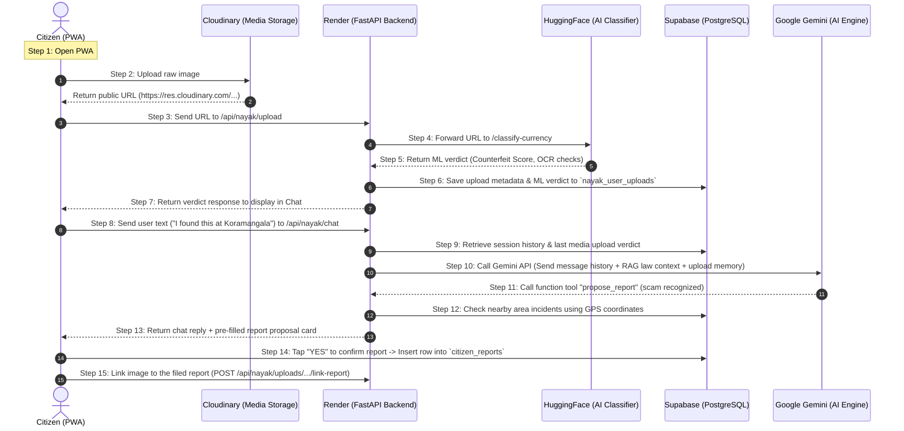

# 🛡️ KAWACH & Nayak AI — Full-Stack Technical Handover & System Architecture Specification

---

# 🔄 How KAWACH Works (A Citizen's Walkthrough Flow)

## 🟢 Simple Language: How it Works (For Frontend Integration)

Here is exactly how the app processes a user action, for example: **A citizen uploads a picture of a fake ₹500 note in the chat and asks if they can trust it.**



### The Step-by-Step Walkthrough

1. **Citizen opens the app:** The browser loads the pre-built React app from **Vercel** (`kawach-two.vercel.app`). Vercel's job is done here; all subsequent operations are direct API calls from the user's browser.
2. **Citizen uploads a photo:** When the user taps the paperclip icon in the Nayak chat and picks an image, the browser uploads the raw bytes **directly to Cloudinary**. Cloudinary returns a public image URL.
3. **URL sent to Backend:** The browser sends that public URL to our Python backend on **Render** (`https://kawach-police.onrender.com/api/nayak/upload`).
4. **Backend calls AI Classifier:** Render fetches the image and passes it to the **Hugging Face** Space microservice.
5. **AI Model Runs:** The Hugging Face server runs the custom trained **EfficientNet** neural network and classical CV checks (security thread continuity, serial number ascending checks). It returns a raw JSON verdict and immediately discards the image (no storage).
6. **Verdict Saved:** Render writes the verdict into **Supabase** under the `nayak_user_uploads` table, linking this session, the image URL, and the classification result.
7. **Verdict Displayed:** Render replies to the browser, and the chat UI displays a message card (e.g., "❌ FLAGGED SUSPICIOUS").
8. **Citizen asks a question:** The citizen types a reply ("I found this at Koramangala market"). The browser sends this to Render via `POST /api/nayak/chat`.
9. **Memory Retrieval:** Render loads the user's chat history plus the last media upload verdict from Supabase.
10. **Gemini Decides:** Render sends this compiled context (history + upload memory) to the **Google Gemini API**. Gemini notices that this is a scam attempt and calls our local `propose_report` function tool.
11. **Report Proposal Enriched:** Render intercepts the tool call, searches Supabase for other incidents nearby (`get_area_incidents`), assigns a civic department, and sends a draft report back to the user's chat.
12. **Citizen Confirms:** The citizen sees a yellow card saying "File Report?". Tapping "YES" makes the browser write a new record directly into the `citizen_reports` table in **Supabase**.
13. **Upload Linked:** The browser tells Render to link the original photo to the new report (`/api/nayak/uploads/{uploadId}/link-report`).
14. **Dashboard Update:** The new report immediately populates the municipal or police dashboard reading from Supabase.

---

## 🛠️ Technical Details & System Flow Specifications

### 📡 1. Media Upload & Forensic Scan Pipeline (`POST /api/nayak/upload`)
* **Endpoint:** `POST https://kawach-police.onrender.com/api/nayak/upload`
* **Request Schema:**
  ```json
  {
    "media_url": "https://res.cloudinary.com/.../img.jpg",
    "media_type": "image", // 'image' or 'video'
    "session_id": "3c9f778a-d9dd-47fe-884d-2bf8aae3c839"
  }
  ```
* **Processing:**
  1. If `media_type` is `"image"`, the backend forwards the binary stream to `https://hikity-kawach-classifier.hf.space/classify-currency`.
  2. If `media_type` is `"video"`, it forwards to `https://hikity-kawach-classifier.hf.space/classify`.
  3. The response is saved in the `nayak_user_uploads` table:
     ```json
     {
       "id": "upload-uuid",
       "session_id": "session-uuid",
       "media_url": "url",
       "media_type": "image",
       "classifier_verdict": {
         "is_authenticated": false,
         "score": 12.5,
         "verdict": "SUSPECT_FEATURES",
         "details": "Currency screening: SUSPECT_FEATURES. Security thread broken; microprint blurry"
       }
     }
     ```

### 💬 2. Nayak Conversational Agent Pipeline (`POST /api/nayak/chat`)
* **Endpoint:** `POST https://kawach-police.onrender.com/api/nayak/chat`
* **Request Schema:**
  ```json
  {
    "session_id": "session-uuid-or-null",
    "message": "User text input",
    "lat": 12.9716,
    "lng": 77.5946
  }
  ```
* **Agent Memory Assembly:**
  1. Retrieve message history from table `nayak_messages` sorted by `created_at` ascending.
  2. Query `nayak_user_uploads` for the most recent upload in this session. Assemble an `uploads_context` string.
  3. Inject `uploads_context` and GPS location into Gemini system instructions.
  4. Call `gemini-1.5-flash` with the history payload, system prompt, and the `tools_manifest` (search_law, check_link, classify_text, get_area_incidents, propose_report).
  5. If Gemini invokes `propose_report`, local backend code calls `enrich_proposal` to look up nearby incidents (`get_area_incidents`), auto-selects the department (e.g. `POLICE`, `FIRE`), sets priority severity, and embeds the reference `upload_id`.
  6. Gemini processes the tool outputs and generates its final conversational response.

### 📝 3. Direct Report Submission (`supabase-js`)
* **File:** `user/src/api/reportService.js`
* **Action:** The frontend inserts directly into Supabase `citizen_reports` using the Anon Key.
* **Fields:** `category`, `description`, `latitude`, `longitude`, `media_url`, `media_type`, `priority`, `routed_department`, `status: 'OPEN'`, `source: 'nayak_chat'`.
* **Link Call:** Once the row is inserted, the frontend triggers `POST /api/nayak/uploads/{uploadId}/link-report` to complete the chain of custody link in the database.

---


## 📌 Executive Summary

**KAWACH** is an enterprise-grade, multi-tenant public safety grid, digital fraud defense ecosystem, and geospatial threat intelligence platform. Built for Indian Public Safety (targeting both AI-driven crime analytics and digital public safety challenges), KAWACH bridges the critical gap between citizens, law enforcement agencies, and municipal civic departments.

### Key Capabilities:
* **Proactive Fraud & Scam Defense:** Intercepts digital arrest calls, UPI scams, fake government links, deepfakes, and counterfeit currency before citizen financial loss occurs.
* **Agentic Citizen Assistant (Nayak):** RAG-powered AI assistant backed by a 3,974-section database of Indian laws (BNS, BNSS, BSA, IT Act, RBI circulars) providing citation-backed legal guidance and auto-drafting reports.
* **Section 65B Certified Chain of Custody:** Generates SHA-256 ledger-hashed court dossiers admissible under Indian Evidence Act Section 65B / BSA rules.
* **Multi-Tenant Civic Routing & SLA Engine:** Zero-bias automated routing across 11 municipal departments (Police, Fire, PWD, Health, Water, etc.) with strict SLA escalation countdowns.

---

## 🏗️ System Architecture & Deployment Overview

```
[ Citizen Sentinel PWA (Vite + React 19) ] ── (HTTPS) ──► [ Vercel Production Deployment ]
       │                                                          │
       ├──► [ Nayak Agent RAG & Emergency API ] ─────────► [ Police Backend (FastAPI + Render) ]
       │                                                         │ ├── PostgreSQL / Supabase DB
       │                                                         │ └── Neo4j Graph DB / In-Memory Mock
       │
       └──► [ Multi-Modal Media Forensic Scan ] ────────► [ AI Classifier Microservice (HF Space) ]
                                                                 ├── PyTorch EfficientNet-B7 (Deepfake)
                                                                 ├── EfficientNet-B0 + EasyOCR (Currency)
                                                                 ├── YOLO12s + SigLIP (Scene Check)
                                                                 └── DistilBERT (Urgency Classifier)
```

### Live Deployment URLs:
* **Citizen PWA Frontend:** `https://kawach-two.vercel.app/`
* **AI Classifier Microservice:** `https://hikity-kawach-classifier.hf.space`
* **Police Command Backend:** Deployed via Docker on Render (`render.yaml`) connected to Supabase Postgres.

---

## 💻 Microservices Breakdown

| Service | Location | Tech Stack | Local Port | Deployment Target | Description |
| :--- | :--- | :--- | :--- | :--- | :--- |
| **Citizen PWA** | `user/` | React 19 + Vite | `5175` | Vercel | Mobile PWA for citizens, EXIF scrubbing, Nayak AI chat, Snap-style safety maps. |
| **AI Classifier** | `Classifier/` | FastAPI + PyTorch + OpenCV | `8001` | HuggingFace Spaces (`7860`) | Multi-modal forensic scanning microservice (Deepfakes, Scene, Currency, Routing). |
| **Police Command Backend** | `police/backend` | FastAPI + SQLAlchemy + Neo4j | `8000` | Render Docker | Offender graph intelligence, DBSCAN hotspot clustering, Digital Arrest monitor, Section 65B PDF dossier generator. |
| **Police Console Frontend** | `police/frontend` | React + Vite | `5173` | Vercel / Static | SP/DGP Command console, GIS maps, offender network graphs, Section 65B exports. |
| **Civic Departments Dashboard** | `departments/` | HTML5 + Vanilla JS + Supabase | Static | Static Web Host | Parameterized shell (`?dept=<id>`) for 11 municipal departments with live SLA countdowns. |

---

## 🧠 AI & ML Pipeline Architecture

KAWACH operates **seven distinct AI/ML and computer vision pipelines**:

### 1. Pipeline 1: Deepfake Video & Audio Forensics (`app/classifier.py`)
* **Architecture:** Frame extraction via `cv2` (32 frames) $\rightarrow$ Face detection via MTCNN $\rightarrow$ Dual **TF-EfficientNet-B7** classifier ensemble.
* **Function:** Detects synthetic media, facial swapping, and voice cloning in uploaded files.
* **Output:** `is_deepfake: bool`, `confidence: float`, `face_count: int`.

### 2. Pipeline 2: Zero-Shot Agency Router & Urgency Classifier (`app/router.py`)
* **Architecture:** **Gemini 2.5 Flash** (zero-shot department mapping) $\rightarrow$ **DistilBERT** (`mrigaanksh/priority-classification-distilbert`) urgency validation.
* **Function:** Maps free-text incident descriptions to matching departments and calculates priority upgrades (LOW, MEDIUM, HIGH, CRITICAL).
* **Fallback:** Local keyword heuristic fallback if API key or network is unreachable.

### 3. Pipeline 3: Visual Scene Analyzer (`app/scene_analyzer.py`)
* **Architecture:** Samples 8 frames $\rightarrow$ **YOLO12s** (Road Damage D00-D44) + **SigLIP TrashNet** classification.
* **Temporal Consistency Engine:** Filters out false positives by enforcing a persistence ratio ($\ge 0.5$) across sampled frames.

### 4. Pipeline 4: Signal Fusion Scoring Engine (`app/trust_scorer.py`)
* **Deterministic Scoring:** Fuses deepfake confidence, visual scene consistency, and NLP priority into two 0–100 metrics:
  * **Unified Trust Score (0–100):** Authenticity rating of the media report.
  * **Civic Urgency Score (0–100):** Dispatch sorting priority.

### 5. Pipeline 5: GIS DBSCAN Hotspot Clustering (`police/backend/app/routes/geo.py`)
* **Algorithm:** DBSCAN with Haversine spatial distance metric (`eps_km=1.0`, `min_samples=3`).
* **Function:** Identifies emerging crime clusters and calculates centroid coordinates for patrol dispatch.

### 6. Pipeline 6: Counterfeit Currency Screening (`Classifier/app/currency_detector.py`)
* **Architecture:** Trained **EfficientNet-B0** CNN (Kaggle T4 trained) + 4 Classical Computer Vision checks:
  1. Security thread continuity & alignment check.
  2. Microprint Laplacian sharpness score.
  3. Print-noise profile analysis.
  4. **Telescopic Serial Number Check:** EasyOCR + column ink-height profiling to verify ascending numeral sizing (RBI anti-counterfeit standard).
* **Performance:** **98.67% test accuracy** (AUC 0.998).
* **UV Mode:** Gated check for `capture_mode="uv"`.

### 7. Pipeline 7: Digital Arrest Live-Session Monitor (`police/backend/app/routes/digital_arrest.py`)
* **Architecture:** Real-time multi-modal session scoring (`POST /api/digital-arrest/session/{id}/signal`).
* **Weights:** Text scam-script scoring (.30) + Voice spoof prob (.20) + Video deepfake prob (.20) + Transaction anomaly (.30).
* **Automated Alerting:** Dispatches `ALERT_DISPATCHED` warning at $\ge 70\%$ threshold *before* monetary transfer completes.

---

## 🗄️ Database Schemas & Models

### 1. PostgreSQL / Supabase Schema (`police/backend/app/models.py` & `citizen_reports`)

#### `citizen_reports` (Public Citizen Table):
```sql
CREATE TABLE citizen_reports (
    id UUID PRIMARY KEY DEFAULT gen_random_uuid(),
    tracking_id TEXT UNIQUE NOT NULL,
    category TEXT NOT NULL,
    sub_category TEXT,
    description TEXT NOT NULL,
    latitude DOUBLE PRECISION,
    longitude DOUBLE PRECISION,
    media_url TEXT,
    media_type TEXT,
    routed_department TEXT NOT NULL,
    priority TEXT DEFAULT 'MEDIUM',
    status TEXT DEFAULT 'OPEN',
    trust_score DOUBLE PRECISION DEFAULT 100.0,
    is_public_visible BOOLEAN DEFAULT TRUE,
    created_at TIMESTAMP WITH TIME ZONE DEFAULT NOW()
);
```

#### `nayak_law_chunks` (Standardized Legal Rulebook Database):
* **Total Records:** 3,974 sections of Indian Law (BNS, BNSS, BSA, IPC, CrPC, IT Act, MVA, COI, etc.).
* **Columns:** `id`, `act`, `section`, `title`, `official_text`, `citizen_scenario`, `citizen_explanation`, `recommended_action`, `penalty_summary`, `tags`, `embedding`.

#### `fir_records`, `offenders`, `vehicles`, `phones`, `calls`, `gangs`, `audit_logs`:
* **FIR Record:** Stores FIR case ID, station info, SLA deadline, status, and timeline arrays.
* **Offender:** Stores priors count, risk score, vehicles, phones, gang affiliations, and associate links.
* **Audit Log:** Hashed, immutable log of all officer queries and PDF exports.

### 2. Neo4j Graph DB Schema (`police/backend/app/routes/network.py`)
* **Nodes:** `Person`, `Phone`, `Account`, `Incident`, `Location`, `Gang`.
* **Relationships:** `ASSOCIATED_WITH`, `OWNED`, `USED_IN`, `OCCURRED_AT`.
* **Intelligence Logic:** Louvain community detection + betweenness centrality + Money Mule flag calculation (`mule_flag` = clean history tied to $\ge 2$ high-risk associates).

---

## 🔌 Core API Route Catalog

### Classifier Microservice (Port 8001 / HF Space 7860)
* `POST /classify` — Runs deepfake video/audio detection on media URL.
* `POST /classify-currency` — Evaluates banknote images (CNN + EasyOCR serial check).
* `POST /route` — Zero-shot NLP department and priority classification.
* `POST /full-analysis` — Unified execution of Pipelines 1, 2, 3, and 4.
* `GET /health` — Diagnostics endpoint reporting `deepfake_mode`, `currency_mode`, and `routing_mode`.

### Police Backend Service (Port 8000 / Render)
* `POST /api/nayak/chat` — Conversational Nayak AI endpoint with session memory & tool calling.
* `GET /api/nayak/search` — Direct keyword/vector search over the 3,974 legal rulebook chunks.
* `POST /api/nayak/upload` — Media scan attachment handler inside citizen chat.
* `POST /api/digital-arrest/session/start` — Initializes live scam tracking session.
* `POST /api/digital-arrest/session/{id}/signal` — Ingests live multi-modal threat signals.
* `POST /api/ai/query` — Police Copilot investigation terminal (FIR summary, offender lookup, plate search).
* `POST /api/reports/generate` — Generates Section 65B compliant PDF dossier with SHA-256 hash seal.
* `GET /api/reports/download/{id}` — Serves signed evidence PDF download.
* `GET /api/geo/hotspots` — Runs real-time DBSCAN spatial clustering over reports.
* `GET /api/network/graph` — Returns graph nodes, Louvain communities, and money mule flags.

---

## 🚦 Non-Negotiable System Guardrails

1. **Separation of Detection and Reporting:** The AI classifier microservice never files a complaint automatically; it always presents a pre-filled proposal card requiring explicit citizen confirmation.
2. **Identity-Free Department Boundary:** Department dashboards (`departments/`) operate strictly on anonymized data (`DEPT_SAFE_COLUMNS`). Reporter identities never pass the boundary to civic queues.
3. **Guilt Inference Lock:** The Police AI Copilot displays strict legal disclaimers explicitly locking guilt inference or automated arrest recommendations.
4. **Honest System Degradation:** When external AI services or databases (Gemini, Neo4j) are offline, the system seamlessly transitions to local keyword search, deterministic heuristics, and mock graph buffers without crashing.

---

## 🛠️ How to Run & Verify the Ecosystem

### 1. Run Citizen PWA (`user/`)
```bash
cd user
npm install
npm run dev -- --port 5175
```
*Access at:* `http://localhost:5175`

### 2. Run Police Backend (`police/backend/`)
```bash
cd police/backend
python -m venv venv
source venv/bin/activate
pip install -r requirements.txt
python app/scripts/seed_entire_rulebook.py  # Seed 3,974 law sections
python -m uvicorn app.main:app --port 8000
```
*Access OpenAPI Docs at:* `http://localhost:8000/docs`

### 3. Run AI Classifier Microservice (`Classifier/`)
```bash
cd Classifier
pip install -r requirements.txt
python download_weights.py
python -m uvicorn app.main:app --port 8001
```
*Access at:* `http://localhost:8001`

### 4. Run Department Dashboards (`departments/`)
```bash
npx serve departments
```
*Access parameterized shell:* `http://localhost:3000/dashboard.html?dept=traffic`

### 5. Execute Automated System Test Suites
```bash
cd police/backend
PYTHONPATH=. ./venv/bin/python3 app/tests/test_nayak.py       # Integration tests
PYTHONPATH=. ./venv/bin/python3 app/tests/test_no_api_key.py # Offline zero-key tests
```

---

*Handover document compiled for **CodeKrafters — KAWACH Platform**.*
