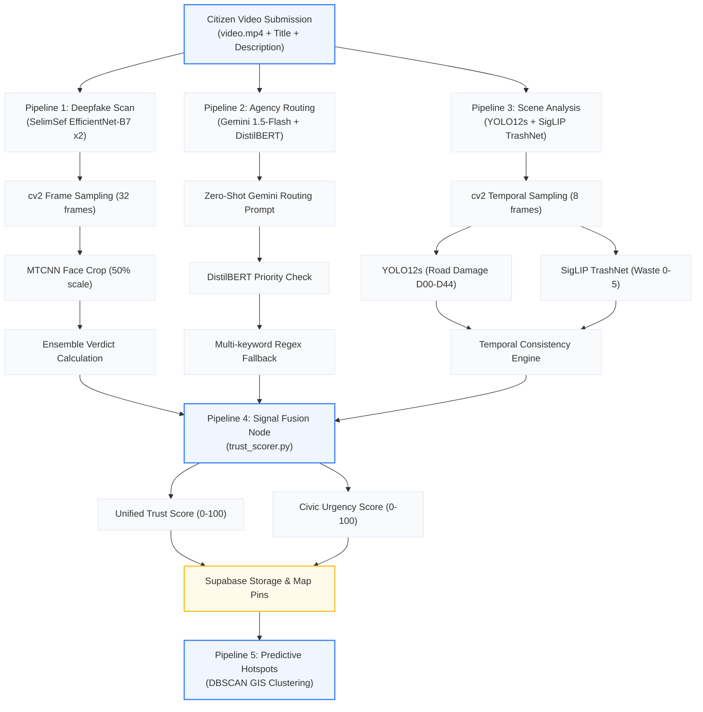

# 🛡️ KAWACH AI System Architecture & Intelligence Pipelines
## End-to-End Core Operations & Data Fusion Walkthrough

KAWACH uses a multi-modal, six-stage artificial intelligence microservice to automate the intake, forensic classification, routing, and predictive mapping of public safety reports. This document outlines the technical layout, model architecture, mathematical scorers, and execution flow of the system.

---

## 🧭 System Pipeline Overview



---

## 📡 Microservice API Gateway

The AI microservice is built using **FastAPI** and is hosted on a Hugging Face Space utilizing a Docker SDK.

| Endpoint | Input Payload | Output Parameters | Purpose |
| :--- | :--- | :--- | :--- |
| **`GET /health`** | None | System status, model loading checks, version, active device | Lifespan checks & heartbeat validation |
| **`POST /classify`** | `file` (MP4 video) | `verdict`, `fake_probability`, `confidence_level` | Forensic Deepfake video scan |
| **`POST /route`** | `title`, `description`, `category` (JSON) | `department`, `sub_category`, `priority`, `escalation_required` | NLP incident categorization & priority scoring |
| **`POST /analyze-scene`** | `file` (MP4 video) | `scene_detected`, `detected_issues`, `temporal_consistency` | Visual pothole/trash verification on frames |
| **`POST /full-analysis`** | `file` + `title` + `description` + `category` (Multipart) | Unified JSON enclosing P1, P2, P3, and P4 parameters | **Main Entry Node:** Aggregated multi-modal analysis |
| **`POST /predict-hotspot`**| `lat`, `lng`, `radius_km`, `recent_reports` (JSON) | `hotspot_likelihood`, `risk_score`, `analysis` | **GIS Predictive Engine:** Dynamic threat clustering |
| **`POST /validate-report`**| `file` (Image/Video) | `scene_detected`, `suggested_dept`, `trust_score` | Mobile PWA preview validator (~600ms latency) |

---

## 🎬 End-to-End Processing Flow

Every incident report goes through **4 core parallel pipelines** inside `main.py` before it is recorded in the Supabase database.

### 🧬 Pipeline 1: Deepfake Forensic Detection (`classifier.py`)
This pipeline verifies that the uploaded video is authentic and hasn't been synthetically generated, cloned, or spoofed.

1. **Frame Selection:** OpenCV (`video_reader.py`) reads the video file and samples **32 evenly-spaced frames** across the entire duration using a linear index space (`np.linspace`).
2. **Face Extraction:** The sampled frames are processed by **MTCNN** (`face_extractor.py`) at **50% scale** to locate face bounding boxes. If detected, face regions are cropped with **33% padding** and scaled back to full resolution.
3. **Ensemble Classification:** The cropped faces are center-padded to a square of `380x380` pixels, normalized to ImageNet weights, and fed through an **ensemble of two TF-EfficientNet-B7** neural networks.
4. **Aggregation Strategy:** The predictions ($p_0$ and $p_1$) from the models are aggregated using the `confident_strategy`:
   * **Verdict AUTHENTIC:** If $< 0.35$ average probability.
   * **Verdict AI_GENERATED:** If $> 0.65$ average probability.
   * **Verdict INCONCLUSIVE:** Otherwise, or if no faces are detected.

---

### 🗳️ Pipeline 2: NLP Department Routing & Priority Validation (`router.py`)
Categorizes textual report parameters into actionable government categories.

1. **Gemini LLM Path:** Submits a zero-shot JSON-formatted system prompt containing the report title and description to `gemini-1.5-flash`. The model maps the report to one of the active departments (`POLICE`, `FIRE`, `HEALTH`, `DISASTER`, `SANITATION`, etc.), assigns a priority tier, and lists an estimated resolution time.
2. **Priority Validation (DistilBERT):**
   * Independently, the text is fed into a fine-tuned **DistilBERT** sequence classification model (`mrigaanksh/priority-classification-distilbert`).
   * DistilBERT outputs a softmax probability vector across `[LOW, MEDIUM, HIGH]` urgency levels.
   * **Urgency Upgrade:** If the DistilBERT priority score exceeds Gemini's tier, the report's final priority is automatically upgraded to the higher tier, setting `priority_upgraded = true`.
3. **3-Layer Fallback:** If API limits are reached, the system executes a **multi-keyword scoring matrix** checking all keyword hits per department to locate the highest scorer, falling back to a generic default category if empty.

---

### 📸 Pipeline 3: Visual Scene Analysis (`scene_analyzer.py`)
Corroborates the video pixels against the text claim to confirm the presence of the incident.

1. **Temporal Sampling:** Samples **8 evenly-spaced frames** to analyze visual indicators.
2. **Double Model Scan:**
   * **YOLO12s (RDD2022):** Scans the frames for road damages, checking for Longitudinal Cracks (`D00`), Transverse Cracks (`D10`), Alligator Cracks (`D20`), Potholes (`D40`), and Repaired Potholes (`D44`). Calculates bounding box coverage area relative to frame size.
   * **TrashNet (SigLIP):** Classifies frames into waste categories: `cardboard`, `glass`, `metal`, `paper`, `plastic`, and `trash` using SigLIP logits.
3. **Temporal Consistency Engine:** Computes the ratio of frames that registered a hit:
   $$\text{Temporal Consistency} = \frac{\text{Frames with Detections}}{8}$$
   * $\ge 0.5$: Indicates a **persistent physical issue** (e.g., a real pothole, reducing false alarms).
   * $< 0.5$: Flagged as an **isolated artefact** (e.g. shadow, glare, or camera smudge).

---

### 🎛️ Pipeline 4: Signal Fusion & Urgency Scoring (`trust_scorer.py`)
Fuses all diagnostic signals into two composite metrics (0-100 scale) for instant console sorting.

#### 🛡️ Trust Score Formula
Measures report credibility and authenticity using a weighted matrix (40% Deepfake + 25% Routing + 35% Visual Scene):

$$\text{Trust Score} = 0.40 \cdot S_{\text{deepfake}} + 0.25 \cdot S_{\text{routing}} + 0.35 \cdot S_{\text{scene}}$$

* **Deepfake Signal ($S_{\text{deepfake}}$):**
  * `AUTHENTIC` verdict: $(1.0 - p_{\text{fake}}) \times 100 \times C_{\text{confidence}}$ (where $C_{\text{confidence}}$ is `HIGH: 1.0`, `MEDIUM: 0.75`, `LOW: 0.50`).
  * `AI_GENERATED` verdict: $\max(5.0, (1.0 - p_{\text{fake}}) \times 28.0)$ (severely penalized).
  * `INCONCLUSIVE` verdict: $38.0$ (neutral).
* **Routing Signal ($S_{\text{routing}}$):**
  * `AI` confidence: $90.0$ | `FALLBACK` keyword match: $60.0$.
* **Scene Signal ($S_{\text{scene}}$):**
  * If issue detected: $\min(97.0, 55.0 + (C_{\text{top\_scene}} \times 35.0) + (C_{\text{temporal}} \times 12.0))$
  * No visual matches: $48.0$ (neutral baseline).

#### 🚨 Civic Urgency Score Formula
Measures emergency severity to sort the dispatch queues. Urgency starts from a base tier and accumulates flags:

$$\text{Urgency} = \text{Base}(P) + \sum \text{Bonuses} - \text{Penalties}$$

* **Base Priority:** `CRITICAL = 88` | `HIGH = 70` | `NORMAL = 48` | `LOW = 20`.
* **Urgency Accumulators:**
  * Escalation Required: $+8.0$
  * Visual Severity is `HIGH`: $+8.0$ (or `MEDIUM`: $+4.0$)
  * DistilBERT Upgrade Triggered: $+5.0$
  * Temporal Consistency $\ge 0.5$ (Persistent): $+6.0$
  * Witness Verification (Real Video + Faces present): $+4.0$
* **Urgency Penalty:**
  * If `AI_GENERATED` deepfake verdict: $-35.0$ (pushed to the bottom of the dispatch queue).

---

## 🔮 Pipeline 5: Predictive Hotspot Analysis (`router.py`)
Predicts emerging municipal crises proactively before they scale.

1. **Weighted Frequency Index:** Computes a coordinate-based risk weight from recent reports:
   $$\text{Risk Score} = (\text{Average Weight} \times 10) + \min(\text{Report Count} \times 3, 60)$$
2. **Gemini Pattern Analysis:** Feeds coordinates, report counts, and categories to Gemini 1.5-flash to:
   * Identify recurring structural or public safety trends.
   * Predict the next logical crisis (e.g. identifying that a cluster of street-lighting outages and property damage reports indicates an emerging crime hotspot).
   * Recommend proactive department actions (e.g., dispatching neighborhood patrols or municipal engineers).

---

## 📋 Comprehensive API Example

### Multipart POST request to `/full-analysis`

```bash
curl -X POST https://hikity-kawach-classifier.hf.space/full-analysis \
  -F "file=@pothole_leak.mp4" \
  -F "title=Water line rupture causing street flooding" \
  -F "description=Main water pipe burst near HSR layout block 2, flooding the road. Vehicles are swerving to avoid a deep pothole covered by water." \
  -F "category=Infrastructure"
```

### Complete JSON Response

```json
{
  "verdict": "AUTHENTIC",
  "fake_probability": 0.082,
  "confidence_level": "HIGH",
  "department": "WATER",
  "sub_category": "pipe_burst",
  "priority": "HIGH",
  "escalation_required": true,
  "estimated_resolution_days": 3,
  "routing_confidence": "AI",
  "distilbert_confidence": 0.941,
  "priority_upgraded": true,
  "scene_detected": true,
  "scene_summary": "Detected 1 road damage instance(s) and 1 waste/garbage instance(s) in video frames. Dominant issue: Pothole. Issue persists across multiple frames — consistent physical problem requiring prompt attention. Recommend immediate escalation.",
  "detected_issues": [
    "Pothole (89%)",
    "Plastic waste detected (65%)"
  ],
  "frames_sampled": 8,
  "road_detections": 1,
  "waste_detections": 1,
  "suggested_dept": "WATER",
  "visual_priority": "HIGH",
  "visual_severity": "HIGH",
  "temporal_consistency": 0.75,
  "dominant_class": "D40",
  "top_detection_confidence": 0.89,
  "trust_score": 86.4,
  "civic_urgency_score": 93.0,
  "processing_time_ms": 6120.5
}
```
